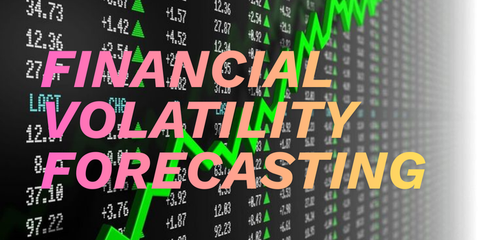
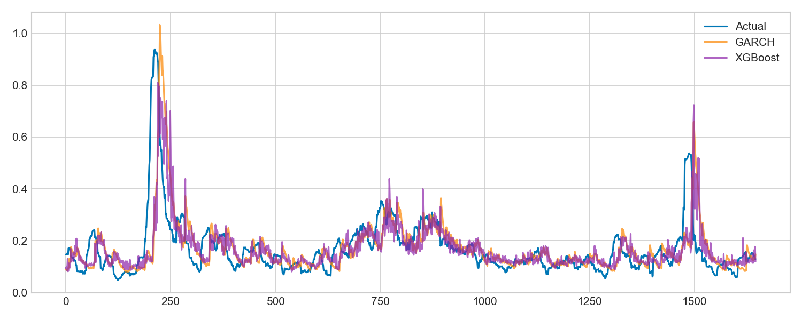
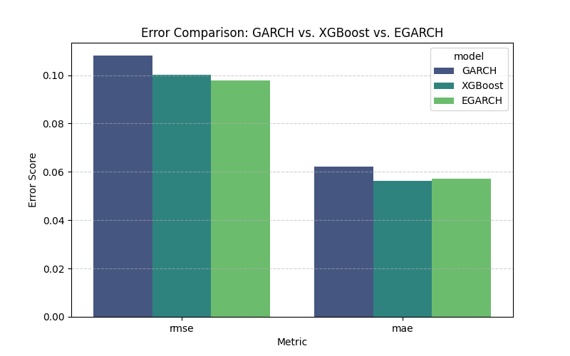
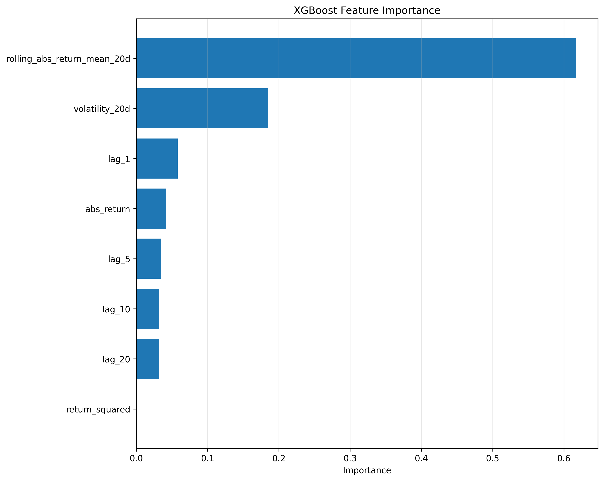

# Key findings: 

**XGBoost outperformed GARCH(1,1) across all metrics:**

| Model     | RMSE  | MAE    | R²     |
|-----------|-------|--------|--------|
| GARCH(1,1)| 0.1078| 0.0622 | 0.1125 |
| XGBoost   | 0.1001| 0.0562 | 0.2347 |

Even modest improvements in volatility forecasting can reduce risk mispricing and improve capital allocation.

## Author

- [@coder-red](https://www.github.com/coder-red)

## Table of Contents

  - [Business context](#business-context)
  - [Data source](#data-source)
  - [Methods](#methods)
  - [Tech Stack](#tech-stack)
  - [Quick glance at the results](#quick-glance-at-the-results)
  - [Lessons learned and recommendation](#lessons-learned-and-recommendation)
  - [Limitation and what can be improved](#limitation-and-what-can-be-improved)
  - [Repository structure](#repository-structure)


## Business context
This model predicts future market volatility.Portfolio managers, traders and financial institutions use this to manage risk, price options, and decide how much exposure to take in financial markets. 

## Data source

- Daily SPY price data was downloaded from Yahoo Finance using the yfinance Python library. It spans from January 1st, 1993 covering approximately 8,300 trading days.


## Methods

- Data cleaning,preprocessing and Feature engineering to create predictive variables
- Exploratory data analysis
- Model training and evaluation with XGBoost and GARCH
- Chronological split (no random shuffling)
- Prevented look-ahead bias by lagging all features

## Tech Stack

- Python (refer to requirement.txt for the packages used in this project)
- Scikit-learn, XGBoost (machine learning & evaluation)
- GARCH(1,1) 4
- GARCH used as a statistical baseline


## Quick glance at the results

Line chart comparing forecasts of XGBoost vs GARCH



Bar Chart of error comparison of XGBoost vs GARCH



Feature importance.




- ***Metrics used: rmse, mae, R²***


### Model Evaluation Strategy

**Primary Metric: RMSE (Root Mean Squared Error)**
Volatility forecasting requires precise predictions since small errors can compound in risk calculations.RMSE penalizes large forecast errors more heavily than MAE, making it best for identifying models that avoid dangerous outliers in volatility estimates.


**Supporting Metrics: MAE (Mean Absolute Error), R²**
- **MAE** shows the model's average size of forecasting error.
- **R²** indicates how much variation in volatility the model explains.


## Lessons Learned and Recommendations

**What I found:**

- **Historical volatility dominates prediction:** The 20-day rolling volatility (`volatility_20d`) was by far the strongest predictor. This confirms volatility persistence.  This is because instead of looking at one noisy day’s move, it looks at the average size of moves over the last 20 days. This helps the model see how turbulent the market has been recently rather than reacting to a single spike.

- **ARCH-style features (abs_return, return_squared) underperformed expectations:** `return_squared` had zero importance (0.0000) in XGBoost. This is likely due to the presence of lagged volatility feature which makes it add little incremental information. The model already captures volatility dynamics through historical rolling volatility.

- **Lagged returns showed limited value:** Lagged returns added very limited incremental value because the rolling volatility feature already captures past returns. Since `volatility_20d` is calculated from the last 20 days of returns, individual lagged returns become redundant.

- **Feature engineering insight:** Simple rolling statistics performed better than complex ARCH-style features for XGBoost. This is likely because for machine learning models, direct volatility lags are more informative than return components (squared, absolute). 

- **XGBoost improved 7% over GARCH:** Even small gains matter in volatility forecasting. The improvement came from better handling of non-linear patterns and regime changes, not from exotic features. 


**Recommendations:**
- Recommendation would be to regularly re train the model on new data and use a simple check to see if the market is in a calm or crazy period, then use settings that fit that period.

## Limitations and What Can Be Improved
**Limitations**
- The XGBoost model is mostly looking at what happened yesterday to predict today. If there is a major sudden market crash or spike, the model may be one day late to react because it hasn't seen the news/pattern yet.

- When there is major market volatility, the model tends to play it a bit safe. It usually predicts a high spike, but the actual spike is often even higher. It is much better at catching the trend than the exact top of the chaos.

**What Can Be Improved**
- Currently the model only looks at historical price and volume data(It lacks awareness). The model needs to listen to the news and that can be achieved with sentiment analysis, by using AI to financial news or Twitter/X trends.

## Repository structure

<details>
  <summary><strong>Repository Structure (click to expand)</strong></summary>

```text

├── data
│   ├── processed
│   └── raw
├── notebooks
│   ├── 01_eda.ipynb
│   ├── 02_garch.ipynb
│   └── 03_ml_vol.ipynb
├── results
│   ├── metrics
│   └── plots
├── src
│   ├── __init__.py
│   ├── config.py
│   ├── data_ingestion.py
│   ├── feature_engineering.py
│   └── model.py
├── .gitignore
├── README.md
└── requirements.txt